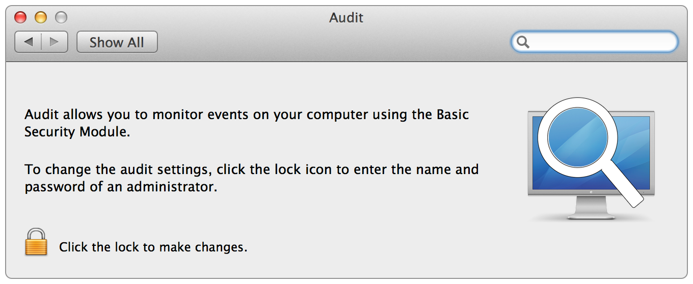
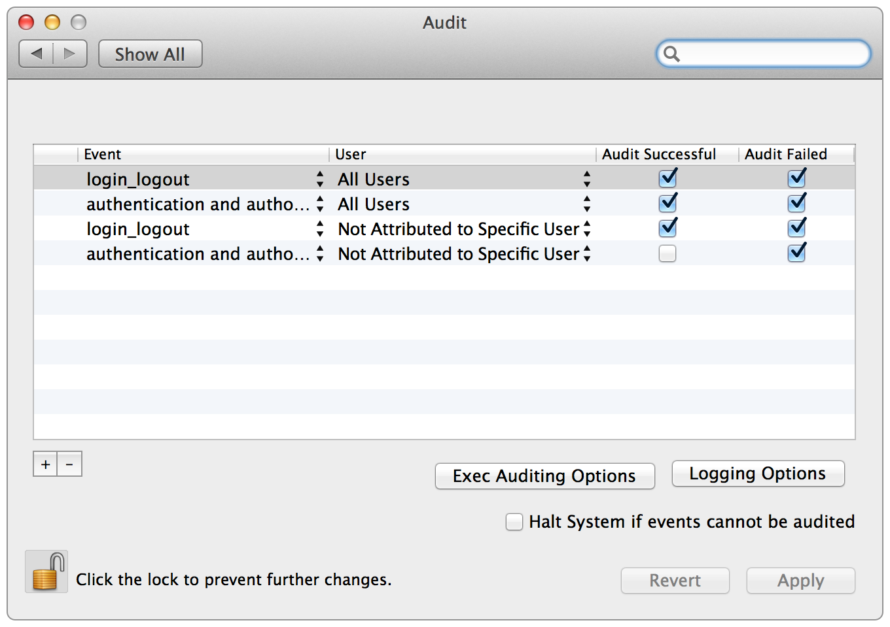
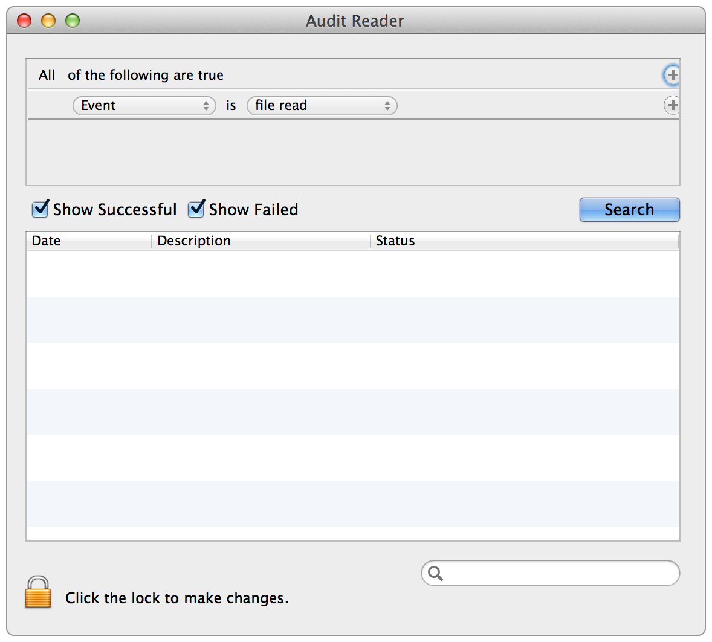

audit
=====

Audit Preference Pane and Log Reader for OS X
----------------------------------------------
OS X has a built in auditing system build into OS X based on OpenBSM.  It is configured and setup via the command line, and has some esoteric syntax.  To deal with this, I created a system preference pane to configure the options, and a log reader to read and search the binary logs. For more detailed information, see man audit on OS X.

The preference pane creates the audit config files in their normal places (/etc/security) and aids in creating the files for later distribution or for individual configuration.

Screenshots
-----------

Main System Preference Pane:

Preference Pane after authenticating:

Log Reader:

